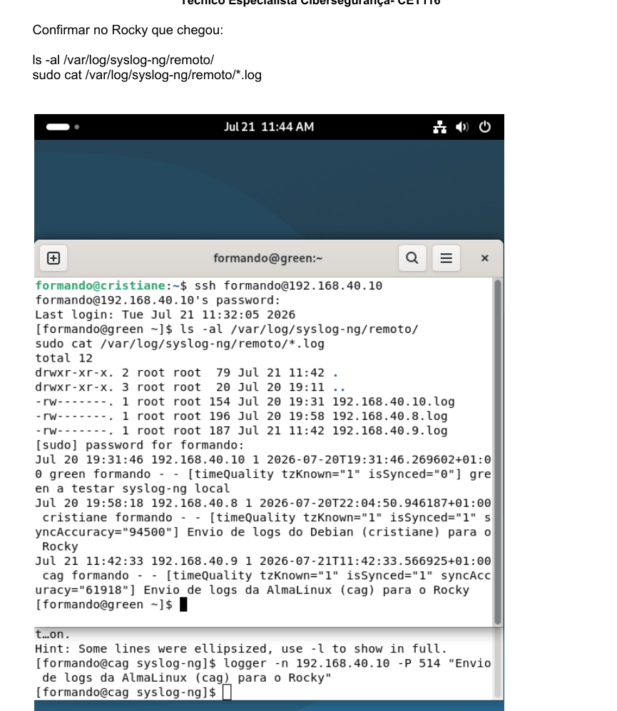
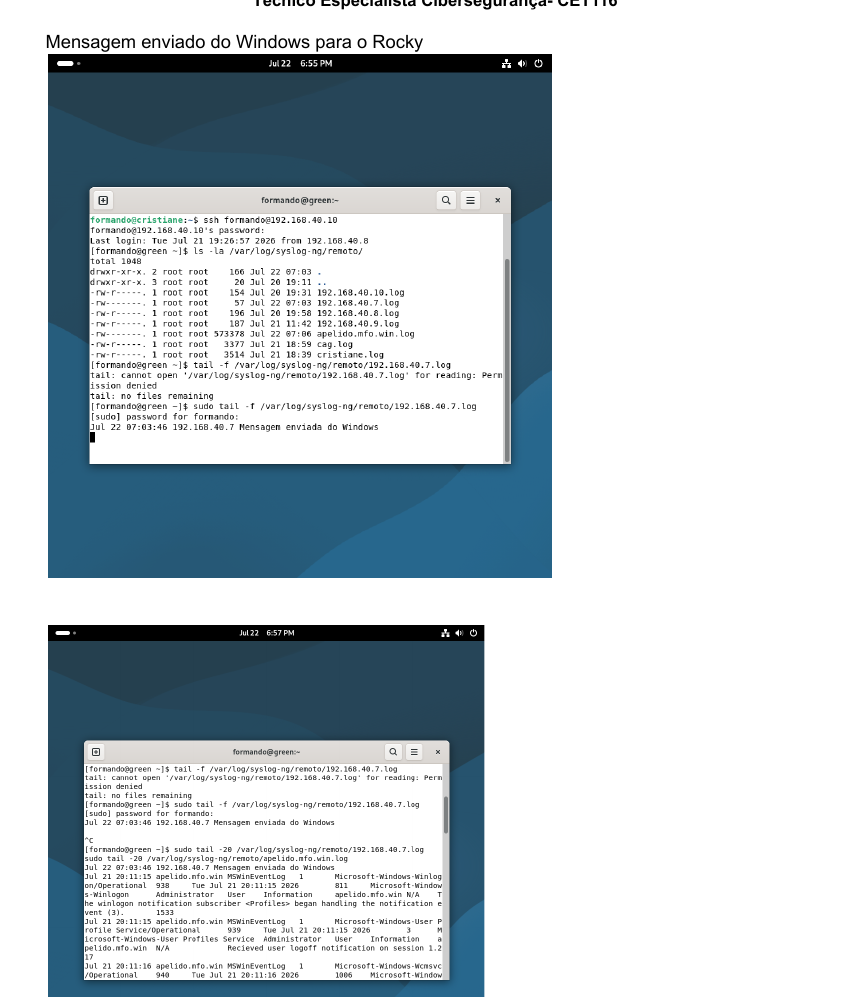
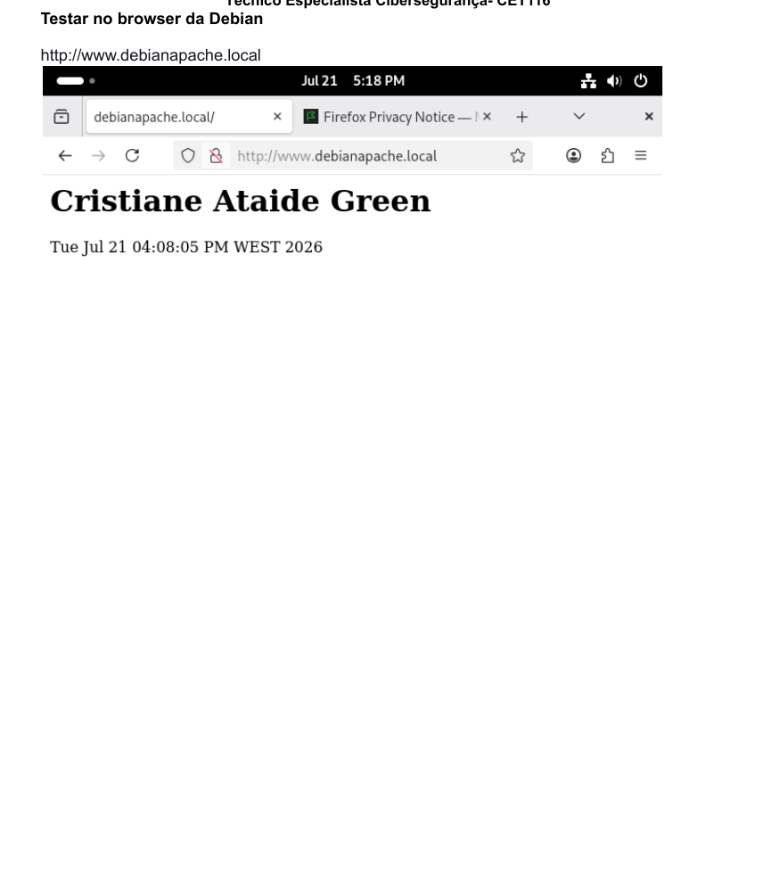
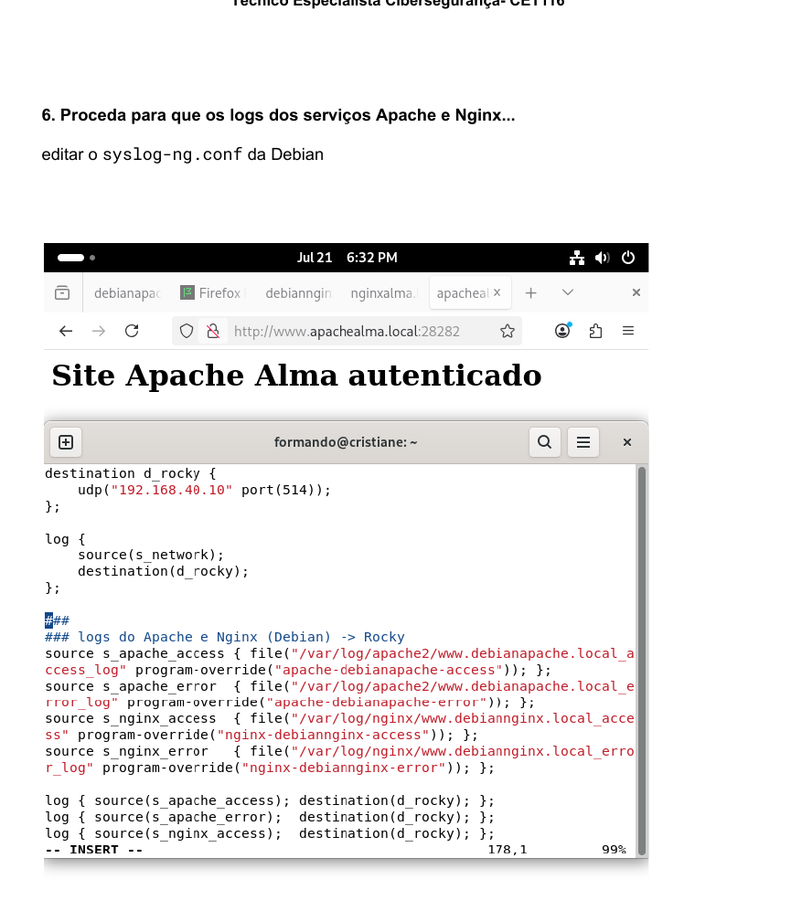
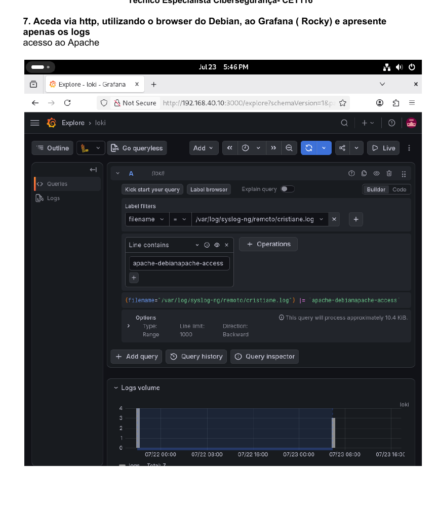
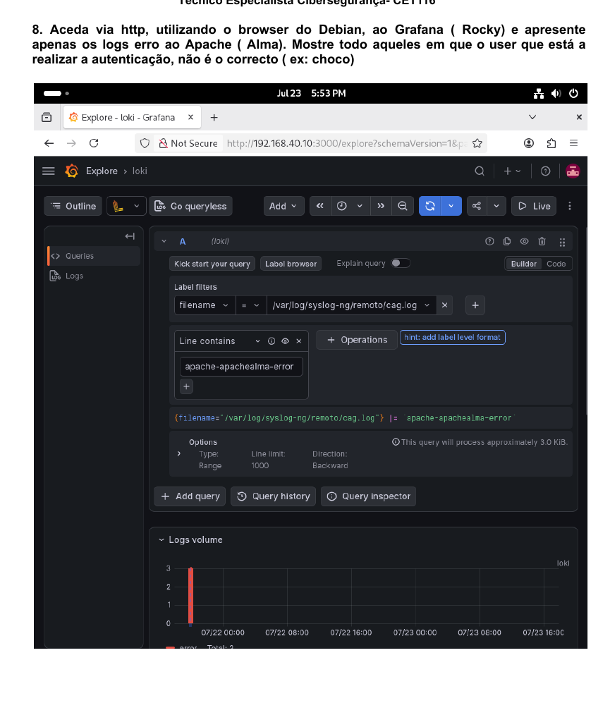
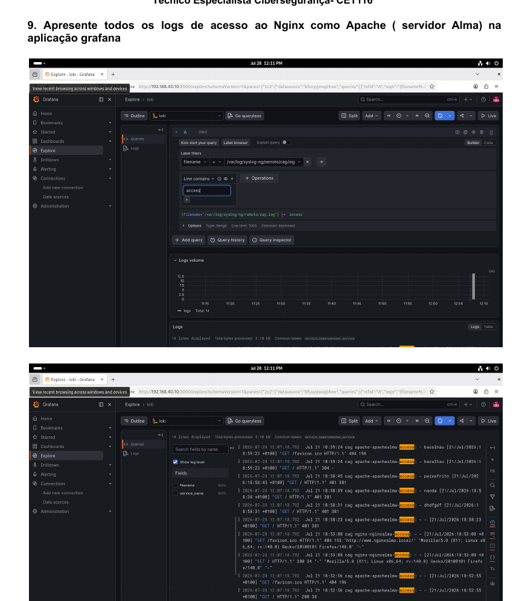
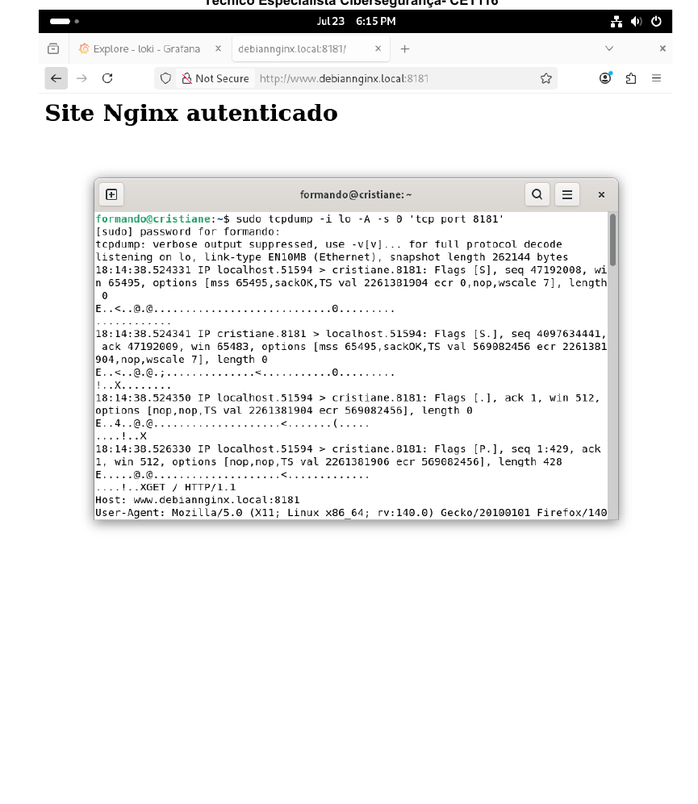

# 📊 Centralized Logging & Monitoring Lab

## Syslog-ng | Grafana | Loki | Alloy | NXLog

This project documents the implementation of a centralized logging and monitoring environment created as part of my Cybersecurity Specialist training.

The lab combined multiple Linux servers and a Windows Server in a virtualized network environment to collect, centralize and analyze system and web server logs.

The project provided hands-on experience with log management, web server monitoring and infrastructure observability.

---

## 🎯 Project Objectives

The main objectives of the lab were to:

- build a multi-server virtualized environment;
- configure static network addressing;
- configure centralized logging with Syslog-ng;
- collect logs from multiple Linux systems;
- integrate Windows Server logs using NXLog;
- deploy Apache and Nginx web servers;
- centralize Apache and Nginx logs;
- implement Grafana, Loki and Alloy;
- visualize and analyze web server activity;
- validate log collection and monitoring;
- analyze network traffic with tcpdump.

---

## 🏗️ Lab Architecture

The environment consisted of four virtual machines connected to the same lab network:

| System | Role |
|---|---|
| Rocky Linux | Central Syslog-ng receiver |
| AlmaLinux | Syslog client + Apache/Nginx web server |
| Debian | Syslog client + Apache/Nginx web server |
| Windows Server | Windows infrastructure + NXLog |

Lab network:

```text
192.168.40.0/24
```

The Rocky Linux server acted as the central logging destination for events generated by the other systems.

---

# 🔄 Centralized Logging with Syslog-ng

## Rocky Linux — Central Log Server

Syslog-ng was configured on Rocky Linux to receive logs from remote systems.

The server was configured to listen for Syslog traffic and store remote logs in a dedicated directory.

Example configuration used during the lab:

```text
source s_network {
    udp(port(514));
    tcp(port(514));
};

destination d_remote {
    file("/var/log/syslog-ng/remoto/${HOST}.log");
};

log {
    source(s_network);
    destination(d_remote);
};
```

Firewall access was also configured for Syslog traffic on port `514`.

## Debian and AlmaLinux — Log Clients

Debian and AlmaLinux were configured to forward logs to the Rocky Linux server.

Test messages were generated using `logger` to verify communication between the clients and the central server.

The validation confirmed that Rocky Linux was receiving and distinguishing logs originating from different systems.

### 📸 Evidence — Centralized Syslog Validation



---

# 🪟 Windows Server Log Integration

Windows Server was also integrated into the centralized logging environment.

NXLog was used during the lab to forward Windows-generated events toward the centralized logging infrastructure.

This extended the environment beyond Linux and provided experience working with logs from different operating systems.

### 📸 Evidence — Windows Log Forwarding



---

# 🌐 Apache & Nginx Web Servers

Apache and Nginx were deployed as part of the lab environment.

The exercise involved configuring and validating web services and later incorporating their logs into the centralized monitoring infrastructure.

### 📸 Evidence — Apache Web Service



---

# 📡 Web Server Log Collection

Apache and Nginx generated access and error logs that were forwarded through the logging infrastructure.

This allowed web activity to be analyzed from a centralized location rather than inspecting each server individually.

The lab included monitoring of:

- Apache access logs;
- Apache error logs;
- Nginx access logs;
- Nginx error logs;
- authentication activity.

### 📸 Evidence — Web Logs Forwarded to Rocky



---

# 📈 Grafana, Loki & Alloy

The monitoring stack incorporated Grafana, Loki and Alloy.

### Grafana

Used to visualize and explore collected log data.

### Loki

Used as the log aggregation and query backend.

### Alloy

Used as part of the log collection and forwarding pipeline.

Together, these tools provided a centralized interface for investigating events generated across the lab infrastructure.

### 📸 Evidence — Apache Logs in Grafana/Loki



---

# 🔎 Log Analysis

The project included practical monitoring and investigation scenarios.

Instead of only confirming that logs were being collected, I used the centralized environment to examine different types of web server activity.

## Authentication Errors

Authentication failures were generated during the lab and the corresponding log activity was examined through the monitoring environment.

### 📸 Evidence — Authentication Error Analysis



## Web Access Analysis

Access activity generated by the web services was also analyzed through the centralized monitoring environment.

### 📸 Evidence — Web Access Analysis



---

# 📦 Network Traffic Analysis with tcpdump

The lab also included the use of `tcpdump` to inspect network traffic associated with web activity.

This exercise demonstrated the relationship between:

**Application Activity → Network Traffic → Logs → Centralized Monitoring**

It reinforced the importance of correlating information from different sources when investigating system and network activity.

### 📸 Evidence — HTTP Traffic Analysis



---

# 🧪 Validation

Several tests were performed throughout the project to confirm that the infrastructure was working correctly.

These included:

- checking Syslog-ng service status;
- generating test messages with `logger`;
- confirming logs arrived on Rocky Linux;
- validating Apache and Nginx services;
- testing web access;
- generating authentication failures;
- checking centralized web logs;
- querying logs through the monitoring stack;
- inspecting traffic using `tcpdump`.

A key validation step confirmed that the Rocky Linux server was successfully receiving and distinguishing logs originating from different systems.

---

# 🧠 What I Learned

This project helped me understand that monitoring is not simply about installing a dashboard.

A functioning monitoring environment depends on several components working together:

**Systems → Services → Logs → Collection → Centralization → Storage → Visualization → Analysis**

Through this lab I practiced:

- Linux server administration;
- centralized log management;
- Syslog configuration;
- Windows and Linux log integration;
- Apache and Nginx administration;
- network troubleshooting;
- firewall configuration;
- log aggregation;
- monitoring and visualization;
- troubleshooting distributed systems.

The project also helped me understand how centralized logging can support security monitoring and incident investigation by providing visibility across multiple systems from a single location.

---

# 🛠️ Technologies

`Linux` `Windows Server` `Syslog-ng` `NXLog` `Apache` `Nginx` `Grafana` `Loki` `Alloy` `tcpdump`

---

# 📚 Training Context

This project was completed as part of my **Cybersecurity Specialist (CET)** training at **CINEL – Lisbon**.

**Unit:** UC01483 — Detecting and Analyzing Vulnerabilities in Web Solutions

**Project:** Syslog-ng, Grafana, Loki and Alloy

**Completed:** August 2026

---

# 👩‍💻 About Me

I am a cybersecurity student based in Portugal building hands-on experience across:

- Network Security
- Linux
- Windows Server
- SIEM & Monitoring
- Vulnerability Management
- Network Traffic Analysis

This repository is part of my cybersecurity portfolio documenting my practical learning journey.
